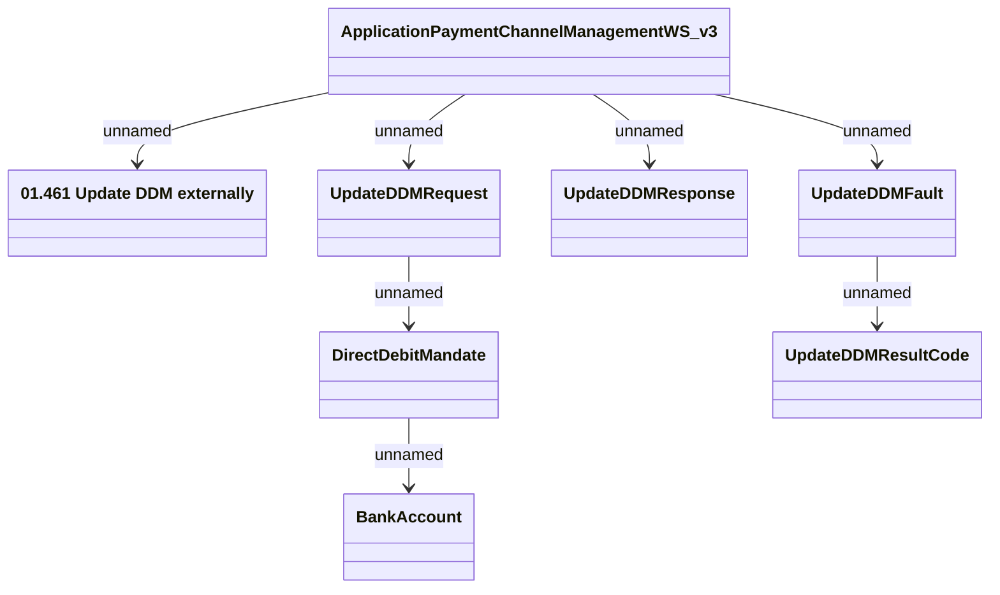

# ApplicationPaymentChannelManagementWS_v3 - Update DDM

```mermaid
classDiagram
    class BankAccount["BankAccount"]
    class DirectDebitMandate["DirectDebitMandate"]
    class n_01_461_Update_DDM_externally["01.461 Update DDM externally"]
    class UpdateDDMRequest["UpdateDDMRequest"]
    class UpdateDDMResponse["UpdateDDMResponse"]
    class UpdateDDMFault["UpdateDDMFault"]
    class UpdateDDMResultCode["UpdateDDMResultCode"]
    class ApplicationPaymentChannelManagementWS_v3["ApplicationPaymentChannelManagementWS_v3"]
    UpdateDDMFault --> UpdateDDMResultCode : unnamed
    ApplicationPaymentChannelManagementWS_v3 --> UpdateDDMFault : unnamed
    ApplicationPaymentChannelManagementWS_v3 --> UpdateDDMResponse : unnamed
    ApplicationPaymentChannelManagementWS_v3 --> UpdateDDMRequest : unnamed
    ApplicationPaymentChannelManagementWS_v3 --> n_01_461_Update_DDM_externally : unnamed
    UpdateDDMRequest --> DirectDebitMandate : unnamed
    DirectDebitMandate --> BankAccount : unnamed
```
