# ApplicationPaymentChannelManagementWS_v3

- **Diagram Type**: Logical
- **Package**: HomerSelect/BSL/Analysis Model/_Interface/Provided Web Services/Application/ApplicationPaymentChannelManagementWS/ApplicationPaymentChannelManagementWS_v3
- **Diagram ID**: 158229
- **Elements**: 7
- **Connectors**: 6

```mermaid
classDiagram
    class ApplicationPaymentChannelManagementWS_v3_ApplicationPaymentC["ApplicationPaymentChannelManagementWS_v3 : ApplicationPaymentChannelManagementWS_v3 - SetPaymentChannel"]
    class ApplicationPaymentChannelManagementWS_v2_ApplicationPaymentC["ApplicationPaymentChannelManagementWS_v2 :ApplicationPaymentChannelManagementWS_v3 - Get DDM by Contract"]
    class ApplicationPaymentChannelManagementWS_v3["ApplicationPaymentChannelManagementWS_v3"]
    class ApplicationPaymentChannelManagementWS_v2_ApplicationPaymentC["ApplicationPaymentChannelManagementWS_v2 :ApplicationPaymentChannelManagementWS_v3 - Update DDM"]
    class ApplicationPaymentChannelManagementWS_v2_ApplicationPaymentC["ApplicationPaymentChannelManagementWS_v2 :ApplicationPaymentChannelManagementWS_v3 - Get Payment Channels"]
    class ApplicationPaymentChannelManagementWS_v2_ApplicationPaymentC["ApplicationPaymentChannelManagementWS_v2 :ApplicationPaymentChannelManagementWS_v3 - Create DDM"]
    class ApplicationPaymentChannelManagementWS_v2_ApplicationPaymentC["ApplicationPaymentChannelManagementWS_v2 :ApplicationPaymentChannelManagementWS_v3 - Change Repayment Channel"]
    ApplicationPaymentChannelManagementWS_v3 --> ApplicationPaymentChannelManagementWS_v2_ApplicationPaymentC : unnamed
    ApplicationPaymentChannelManagementWS_v3 --> ApplicationPaymentChannelManagementWS_v2_ApplicationPaymentC : unnamed
    ApplicationPaymentChannelManagementWS_v3 --> ApplicationPaymentChannelManagementWS_v2_ApplicationPaymentC : unnamed
    ApplicationPaymentChannelManagementWS_v3 --> ApplicationPaymentChannelManagementWS_v2_ApplicationPaymentC : unnamed
    ApplicationPaymentChannelManagementWS_v3 --> ApplicationPaymentChannelManagementWS_v2_ApplicationPaymentC : unnamed
    ApplicationPaymentChannelManagementWS_v3 --> ApplicationPaymentChannelManagementWS_v3_ApplicationPaymentC : unnamed
```

