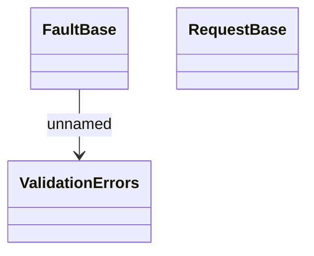

# Common

```mermaid
classDiagram
    class ValidationErrors["ValidationErrors"]
    class FaultBase["FaultBase"]
    class RequestBase["RequestBase"]
    FaultBase --> ValidationErrors : unnamed
```
