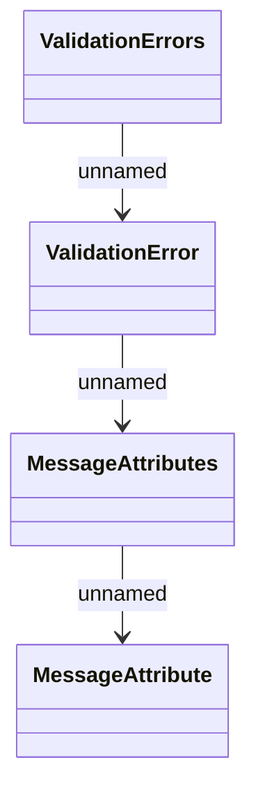

# ValidationErrors

```mermaid
classDiagram
    class MessageAttribute["MessageAttribute"]
    class MessageAttributes["MessageAttributes"]
    class ValidationError["ValidationError"]
    class ValidationErrors["ValidationErrors"]
    ValidationErrors --> ValidationError : unnamed
    ValidationError --> MessageAttributes : unnamed
    MessageAttributes --> MessageAttribute : unnamed
```
