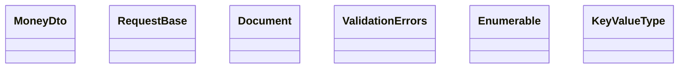

# Common

- **Diagram Type**: Logical
- **Package**: HomerSelect/BSL/Analysis Model/_Interface/Provided Web Services/Application/Common XSD/Common (v2)
- **Diagram ID**: 139220
- **Elements**: 6
- **Connectors**: 0

