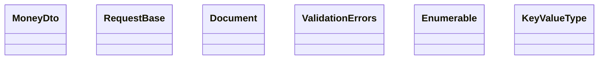

# Common

```mermaid
classDiagram
    class MoneyDto["MoneyDto"]
    class RequestBase["RequestBase"]
    class Document["Document"]
    class ValidationErrors["ValidationErrors"]
    class Enumerable["Enumerable"]
    class KeyValueType["KeyValueType"]
```
