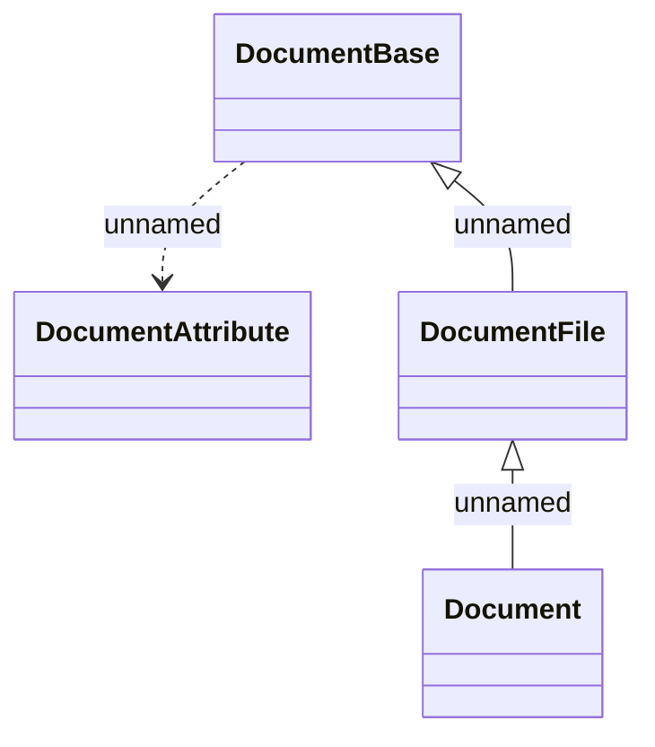

# Document

- **Diagram Type**: Logical
- **Package**: HomerSelect/BSL/Analysis Model/_Interface/Provided Web Services/Application/Common XSD/Common (v2)
- **Diagram ID**: 139221
- **Elements**: 4
- **Connectors**: 3

