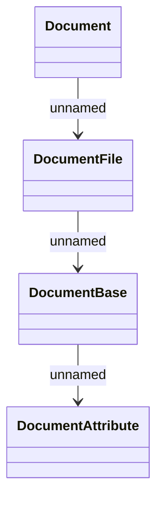

# Document

```mermaid
classDiagram
    class DocumentAttribute["DocumentAttribute"]
    class DocumentBase["DocumentBase"]
    class DocumentFile["DocumentFile"]
    class Document["Document"]
    Document --> DocumentFile : unnamed
    DocumentFile --> DocumentBase : unnamed
    DocumentBase --> DocumentAttribute : unnamed
```
