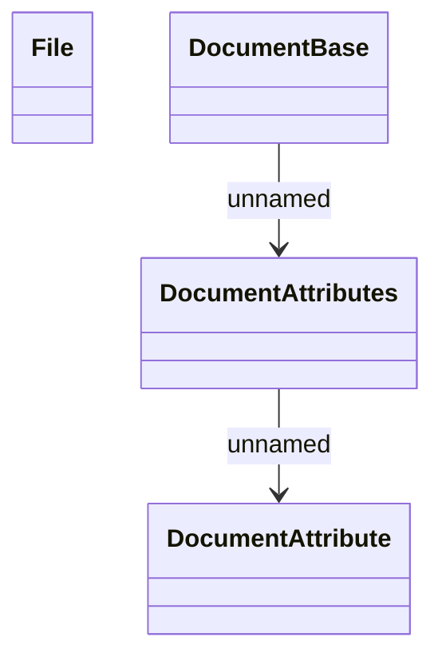

# Document

```mermaid
classDiagram
    class DocumentAttributes["DocumentAttributes"]
    class DocumentAttribute["DocumentAttribute"]
    class File["File"]
    class DocumentBase["DocumentBase"]
    DocumentAttributes --> DocumentAttribute : unnamed
    DocumentBase --> DocumentAttributes : unnamed
```
