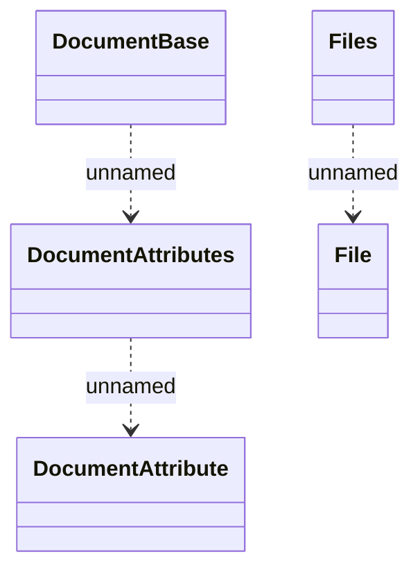

# Document

- **Diagram Type**: Logical
- **Package**: HomerSelect/BSL/Analysis Model/_Interface/Provided Web Services/Application/Common XSD/Common (v4)
- **Diagram ID**: 158502
- **Elements**: 5
- **Connectors**: 3

