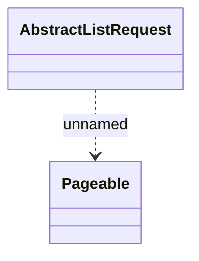

# Common - request

- **Diagram Type**: Logical
- **Package**: HomerSelect/BSL/Analysis Model/_Interface/Provided Web Services/Application/EnumManagementWS
- **Diagram ID**: 147867
- **Elements**: 2
- **Connectors**: 1

