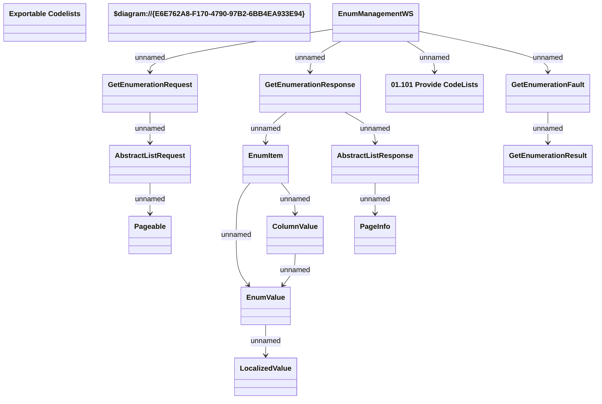

# EnumManagementWS

```mermaid
classDiagram
    class AbstractListResponse["AbstractListResponse"]
    class PageInfo["PageInfo"]
    class Pageable["Pageable"]
    class AbstractListRequest["AbstractListRequest"]
    class GetEnumerationResult["GetEnumerationResult"]
    class GetEnumerationFault["GetEnumerationFault"]
    class Exportable_Codelists["Exportable Codelists"]
    class diagram_E6E762A8_F170_4790_97B2_6BB4EA933E94["$diagram://{E6E762A8-F170-4790-97B2-6BB4EA933E94}"]
    class n_01_101_Provide_CodeLists["01.101 Provide CodeLists"]
    class ColumnValue["ColumnValue"]
    class EnumValue["EnumValue"]
    class LocalizedValue["LocalizedValue"]
    class EnumItem["EnumItem"]
    class GetEnumerationResponse["GetEnumerationResponse"]
    class GetEnumerationRequest["GetEnumerationRequest"]
    class EnumManagementWS["EnumManagementWS"]
    EnumManagementWS --> GetEnumerationRequest : unnamed
    EnumManagementWS --> GetEnumerationResponse : unnamed
    GetEnumerationResponse --> EnumItem : unnamed
    EnumValue --> LocalizedValue : unnamed
    ColumnValue --> EnumValue : unnamed
    EnumItem --> EnumValue : unnamed
    EnumItem --> ColumnValue : unnamed
    EnumManagementWS --> n_01_101_Provide_CodeLists : unnamed
    EnumManagementWS --> GetEnumerationFault : unnamed
    GetEnumerationFault --> GetEnumerationResult : unnamed
    GetEnumerationRequest --> AbstractListRequest : unnamed
    AbstractListRequest --> Pageable : unnamed
    AbstractListResponse --> PageInfo : unnamed
    GetEnumerationResponse --> AbstractListResponse : unnamed
```
