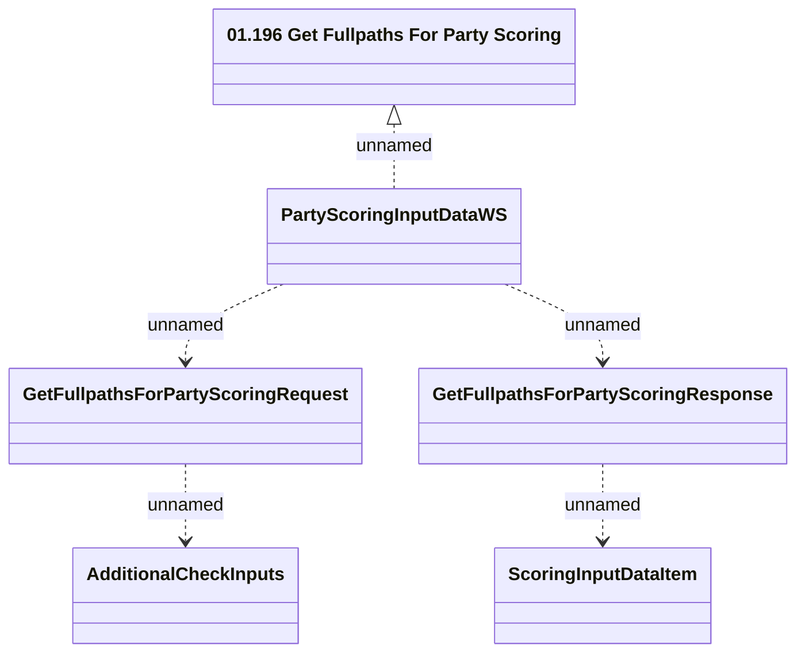

# PartyScoringInputDataWS - Get Fullpaths For Party Scoring

- **Diagram Type**: Logical
- **Package**: HomerSelect/BSL/Analysis Model/_Interface/Provided Web Services/Application/PartyScoringInputDataWS
- **Diagram ID**: 132802
- **Elements**: 6
- **Connectors**: 5

