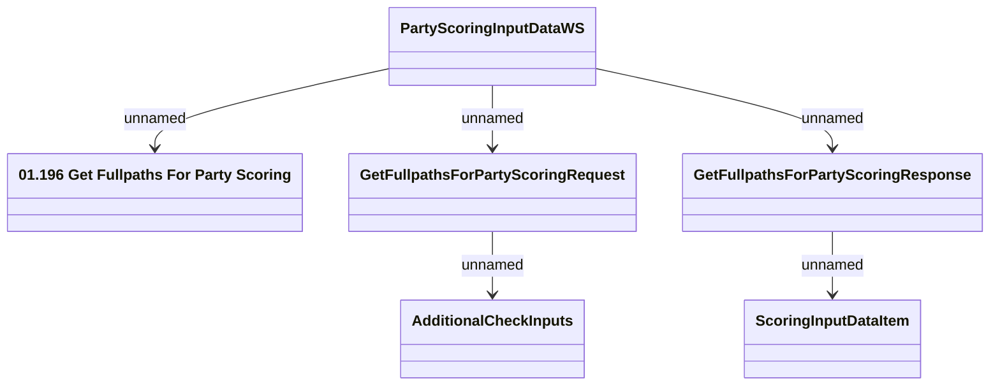

# PartyScoringInputDataWS - Get Fullpaths For Party Scoring

```mermaid
classDiagram
    class n_01_196_Get_Fullpaths_For_Party_Scoring["01.196 Get Fullpaths For Party Scoring"]
    class ScoringInputDataItem["ScoringInputDataItem"]
    class GetFullpathsForPartyScoringResponse["GetFullpathsForPartyScoringResponse"]
    class GetFullpathsForPartyScoringRequest["GetFullpathsForPartyScoringRequest"]
    class AdditionalCheckInputs["AdditionalCheckInputs"]
    class PartyScoringInputDataWS["PartyScoringInputDataWS"]
    GetFullpathsForPartyScoringRequest --> AdditionalCheckInputs : unnamed
    PartyScoringInputDataWS --> GetFullpathsForPartyScoringRequest : unnamed
    PartyScoringInputDataWS --> GetFullpathsForPartyScoringResponse : unnamed
    GetFullpathsForPartyScoringResponse --> ScoringInputDataItem : unnamed
    PartyScoringInputDataWS --> n_01_196_Get_Fullpaths_For_Party_Scoring : unnamed
```
