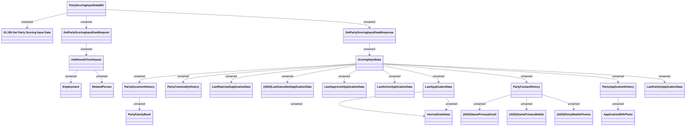

# PartyScoringInputDataWS - Get Party Scoring Input Data

```mermaid
classDiagram
    class Employment["Employment"]
    class RelatedPerson["RelatedPerson"]
    class PartyFamilyBook["PartyFamilyBook"]
    class PartyDocumentHistory["PartyDocumentHistory"]
    class InternalCodeData["InternalCodeData"]
    class PartyCommodityHistory["PartyCommodityHistory"]
    class ADD_SamePrimaryEmail["{ADD}SamePrimaryEmail"]
    class ADD_SamePrimaryMobile["{ADD}SamePrimaryMobile"]
    class LastRejectedApplicationData["LastRejectedApplicationData"]
    class ADD_LastCancelledApplicationData["{ADD}LastCancelledApplicationData"]
    class LastApprovedApplicationData["LastApprovedApplicationData"]
    class LastActiveApplicationData["LastActiveApplicationData"]
    class LastApplicationData["LastApplicationData"]
    class ScoringInputData["ScoringInputData"]
    class ADD_PartyMobilePhones["{ADD}PartyMobilePhones"]
    class PartyContactHistory["PartyContactHistory"]
    class ApplicationWithPhoto["ApplicationWithPhoto"]
    class PartyApplicationHistory["PartyApplicationHistory"]
    class LastFamilyApplicationData["LastFamilyApplicationData"]
    class n_01_195_Get_Party_Scoring_Input_Data["01.195 Get Party Scoring Input Data"]
    class GetPartyScoringInputDataRequest["GetPartyScoringInputDataRequest"]
    class AdditionalCheckInputs["AdditionalCheckInputs"]
    class GetPartyScoringInputDataResponse["GetPartyScoringInputDataResponse"]
    class PartyScoringInputDataWS["PartyScoringInputDataWS"]
    ScoringInputData --> LastActiveApplicationData : unnamed
    AdditionalCheckInputs --> RelatedPerson : unnamed
    PartyDocumentHistory --> PartyFamilyBook : unnamed
    ScoringInputData --> PartyDocumentHistory : unnamed
    LastApplicationData --> InternalCodeData : unnamed
    LastApplicationData --> InternalCodeData : unnamed
    ScoringInputData --> PartyCommodityHistory : unnamed
    PartyContactHistory --> ADD_SamePrimaryEmail : unnamed
    PartyContactHistory --> ADD_SamePrimaryMobile : unnamed
    ScoringInputData --> LastRejectedApplicationData : unnamed
    AdditionalCheckInputs --> Employment : unnamed
    ScoringInputData --> LastApprovedApplicationData : unnamed
    PartyScoringInputDataWS --> GetPartyScoringInputDataResponse : unnamed
    ScoringInputData --> LastApplicationData : unnamed
    GetPartyScoringInputDataResponse --> ScoringInputData : unnamed
    PartyContactHistory --> ADD_PartyMobilePhones : unnamed
    ScoringInputData --> PartyContactHistory : unnamed
    PartyApplicationHistory --> ApplicationWithPhoto : unnamed
    ScoringInputData --> PartyApplicationHistory : unnamed
    ScoringInputData --> LastFamilyApplicationData : unnamed
    PartyScoringInputDataWS --> n_01_195_Get_Party_Scoring_Input_Data : unnamed
    PartyScoringInputDataWS --> GetPartyScoringInputDataRequest : unnamed
    GetPartyScoringInputDataRequest --> AdditionalCheckInputs : unnamed
    ScoringInputData --> ADD_LastCancelledApplicationData : unnamed
```
