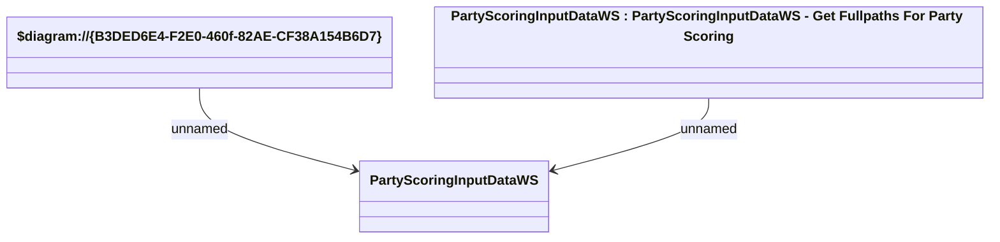

# PartyScoringInputDataWS

- **Diagram Type**: Logical
- **Package**: HomerSelect/BSL/Analysis Model/_Interface/Provided Web Services/Application/PartyScoringInputDataWS
- **Diagram ID**: 132803
- **Elements**: 3
- **Connectors**: 2

