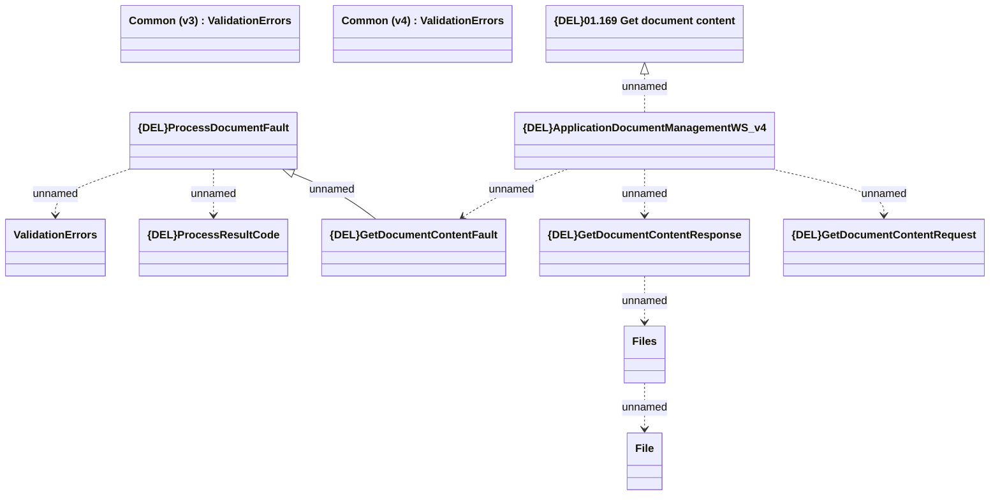

# {DEL}ApplicationDocumentManagementWS_v4 - GetDocumentContent

- **Diagram Type**: Logical
- **Package**: HomerSelect/BSL/Analysis Model/_Interface/Provided Web Services/Application/{DEL}ApplicationDocumentManagementWS/{DEL}ApplicationDocumentManagementWS_v4
- **Diagram ID**: 158341
- **Elements**: 14
- **Connectors**: 9

