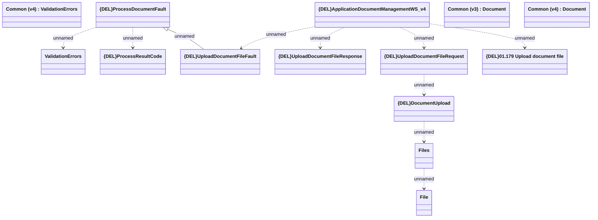

# {DEL}ApplicationDocumentManagementWS_v4 - UploadDocumentFile

- **Diagram Type**: Logical
- **Package**: HomerSelect/BSL/Analysis Model/_Interface/Provided Web Services/Application/{DEL}ApplicationDocumentManagementWS/{DEL}ApplicationDocumentManagementWS_v4
- **Diagram ID**: 158343
- **Elements**: 15
- **Connectors**: 10

