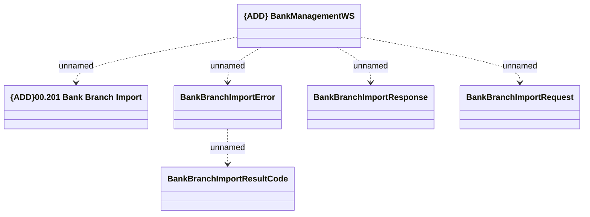

# Bank Management - ImportBankBranch

- **Diagram Type**: Logical
- **Package**: HomerSelect/BSL/Analysis Model/_Interface/Provided Web Services/Bank Management
- **Diagram ID**: 131387
- **Elements**: 6
- **Connectors**: 5

