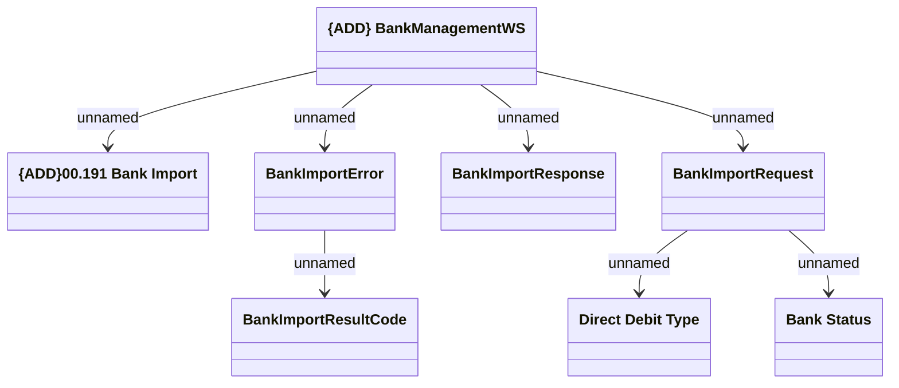

# BankManagementWS - BankImport

```mermaid
classDiagram
    class ADD_00_191_Bank_Import["{ADD}00.191 Bank Import"]
    class BankImportResultCode["BankImportResultCode"]
    class BankImportError["BankImportError"]
    class Direct_Debit_Type["Direct Debit Type"]
    class Bank_Status["Bank Status"]
    class BankImportResponse["BankImportResponse"]
    class BankImportRequest["BankImportRequest"]
    class ADD_BankManagementWS["{ADD} BankManagementWS"]
    ADD_BankManagementWS --> ADD_00_191_Bank_Import : unnamed
    ADD_BankManagementWS --> BankImportResponse : unnamed
    ADD_BankManagementWS --> BankImportError : unnamed
    ADD_BankManagementWS --> BankImportRequest : unnamed
    BankImportRequest --> Direct_Debit_Type : unnamed
    BankImportRequest --> Bank_Status : unnamed
    BankImportError --> BankImportResultCode : unnamed
```
