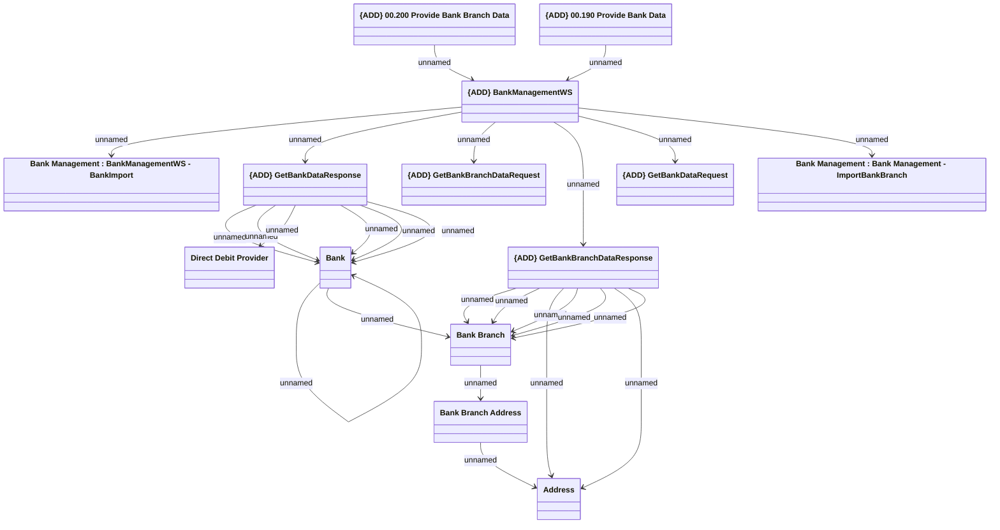

# BankManagementWS

```mermaid
classDiagram
    class Bank_Management_BankManagementWS_BankImport["Bank Management : BankManagementWS - BankImport"]
    class Bank_Management_Bank_Management_ImportBankBranch["Bank Management : Bank Management - ImportBankBranch"]
    class ADD_00_200_Provide_Bank_Branch_Data["{ADD} 00.200 Provide Bank Branch Data"]
    class ADD_00_190_Provide_Bank_Data["{ADD} 00.190 Provide Bank Data"]
    class Address["Address"]
    class Bank_Branch_Address["Bank Branch Address"]
    class Direct_Debit_Provider["Direct Debit Provider"]
    class Bank["Bank"]
    class Bank_Branch["Bank Branch"]
    class ADD_GetBankBranchDataRequest["{ADD} GetBankBranchDataRequest"]
    class ADD_GetBankBranchDataResponse["{ADD} GetBankBranchDataResponse"]
    class ADD_GetBankDataResponse["{ADD} GetBankDataResponse"]
    class ADD_GetBankDataRequest["{ADD} GetBankDataRequest"]
    class ADD_BankManagementWS["{ADD} BankManagementWS"]
    ADD_GetBankDataResponse --> Bank : unnamed
    ADD_GetBankBranchDataResponse --> Bank_Branch : unnamed
    ADD_GetBankBranchDataResponse --> Bank_Branch : unnamed
    ADD_GetBankBranchDataResponse --> Address : unnamed
    ADD_GetBankBranchDataResponse --> Bank_Branch : unnamed
    ADD_GetBankBranchDataResponse --> Bank_Branch : unnamed
    ADD_GetBankBranchDataResponse --> Address : unnamed
    ADD_BankManagementWS --> Bank_Management_BankManagementWS_BankImport : unnamed
    ADD_GetBankDataResponse --> Bank : unnamed
    ADD_GetBankDataResponse --> Direct_Debit_Provider : unnamed
    ADD_GetBankDataResponse --> Bank : unnamed
    ADD_GetBankDataResponse --> Bank : unnamed
    ADD_GetBankDataResponse --> Bank : unnamed
    ADD_BankManagementWS --> ADD_GetBankDataResponse : unnamed
    ADD_BankManagementWS --> ADD_GetBankBranchDataRequest : unnamed
    ADD_BankManagementWS --> ADD_GetBankBranchDataResponse : unnamed
    ADD_BankManagementWS --> ADD_GetBankDataRequest : unnamed
    ADD_BankManagementWS --> Bank_Management_Bank_Management_ImportBankBranch : unnamed
    ADD_GetBankBranchDataResponse --> Bank_Branch : unnamed
    ADD_00_200_Provide_Bank_Branch_Data --> ADD_BankManagementWS : unnamed
    ADD_00_190_Provide_Bank_Data --> ADD_BankManagementWS : unnamed
    Bank --> Bank : unnamed
    Bank --> Bank_Branch : unnamed
    Bank_Branch_Address --> Address : unnamed
    Bank_Branch --> Bank_Branch_Address : unnamed
```
