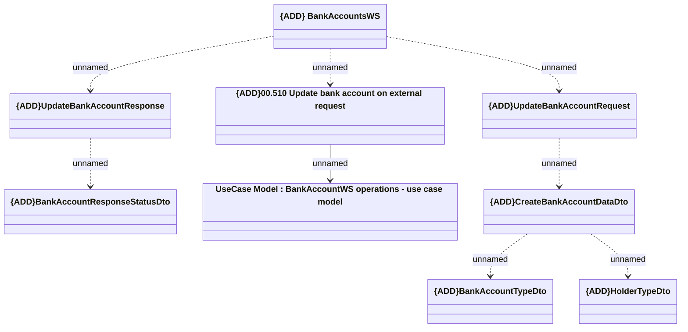

# BankAccountsWS.updateBankAccount()

- **Diagram Type**: Logical
- **Package**: HomerSelect/BSL/Analysis Model/_Interface/Provided Web Services/Bank accounts
- **Diagram ID**: 119290
- **Elements**: 9
- **Connectors**: 8

