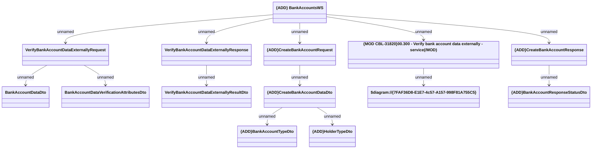

# BankAccountsWS.verifyBankAccountDataExternally()

```mermaid
classDiagram
    class BankAccountDataDto["BankAccountDataDto"]
    class ADD_HolderTypeDto["{ADD}HolderTypeDto"]
    class BankAccountDataVerificationAttributesDto["BankAccountDataVerificationAttributesDto"]
    class ADD_BankAccountTypeDto["{ADD}BankAccountTypeDto"]
    class VerifyBankAccountDataExternallyResultDto["VerifyBankAccountDataExternallyResultDto"]
    class ADD_CreateBankAccountDataDto["{ADD}CreateBankAccountDataDto"]
    class diagram_7FAF36D8_E1E7_4c57_A157_998F81A755C5["$diagram://{7FAF36D8-E1E7-4c57-A157-998F81A755C5}"]
    class ADD_CreateBankAccountRequest["{ADD}CreateBankAccountRequest"]
    class MOD_CBL_31820_00_300_Verify_bank_account_data_externally_ser["{MOD CBL-31820}00.300 - Verify bank account data externally - service(/MOD)"]
    class ADD_BankAccountResponseStatusDto["{ADD}BankAccountResponseStatusDto"]
    class VerifyBankAccountDataExternallyResponse["VerifyBankAccountDataExternallyResponse"]
    class ADD_CreateBankAccountResponse["{ADD}CreateBankAccountResponse"]
    class VerifyBankAccountDataExternallyRequest["VerifyBankAccountDataExternallyRequest"]
    class ADD_BankAccountsWS["{ADD} BankAccountsWS"]
    ADD_BankAccountsWS --> VerifyBankAccountDataExternallyRequest : unnamed
    ADD_BankAccountsWS --> ADD_CreateBankAccountResponse : unnamed
    ADD_BankAccountsWS --> VerifyBankAccountDataExternallyResponse : unnamed
    ADD_CreateBankAccountResponse --> ADD_BankAccountResponseStatusDto : unnamed
    ADD_BankAccountsWS --> MOD_CBL_31820_00_300_Verify_bank_account_data_externally_ser : unnamed
    ADD_BankAccountsWS --> ADD_CreateBankAccountRequest : unnamed
    ADD_CreateBankAccountRequest --> ADD_CreateBankAccountDataDto : unnamed
    VerifyBankAccountDataExternallyResponse --> VerifyBankAccountDataExternallyResultDto : unnamed
    VerifyBankAccountDataExternallyRequest --> BankAccountDataVerificationAttributesDto : unnamed
    VerifyBankAccountDataExternallyRequest --> BankAccountDataDto : unnamed
    ADD_CreateBankAccountDataDto --> ADD_BankAccountTypeDto : unnamed
    ADD_CreateBankAccountDataDto --> ADD_HolderTypeDto : unnamed
    MOD_CBL_31820_00_300_Verify_bank_account_data_externally_ser --> diagram_7FAF36D8_E1E7_4c57_A157_998F81A755C5 : unnamed
```
