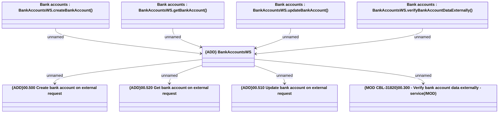

# BankAccountsWS

```mermaid
classDiagram
    class Bank_accounts_BankAccountsWS_verifyBankAccountDataExternally["Bank accounts : BankAccountsWS.verifyBankAccountDataExternally()"]
    class Bank_accounts_BankAccountsWS_updateBankAccount["Bank accounts : BankAccountsWS.updateBankAccount()"]
    class Bank_accounts_BankAccountsWS_getBankAccount["Bank accounts : BankAccountsWS.getBankAccount()"]
    class Bank_accounts_BankAccountsWS_createBankAccount["Bank accounts : BankAccountsWS.createBankAccount()"]
    class MOD_CBL_31820_00_300_Verify_bank_account_data_externally_ser["{MOD CBL-31820}00.300 - Verify bank account data externally - service(/MOD)"]
    class ADD_00_510_Update_bank_account_on_external_request["{ADD}00.510 Update bank account on external request"]
    class ADD_00_520_Get_bank_account_on_external_request["{ADD}00.520 Get bank account on external request"]
    class ADD_00_500_Create_bank_account_on_external_request["{ADD}00.500 Create bank account on external request"]
    class ADD_BankAccountsWS["{ADD} BankAccountsWS"]
    Bank_accounts_BankAccountsWS_createBankAccount --> ADD_BankAccountsWS : unnamed
    Bank_accounts_BankAccountsWS_getBankAccount --> ADD_BankAccountsWS : unnamed
    Bank_accounts_BankAccountsWS_updateBankAccount --> ADD_BankAccountsWS : unnamed
    Bank_accounts_BankAccountsWS_verifyBankAccountDataExternally --> ADD_BankAccountsWS : unnamed
    ADD_BankAccountsWS --> ADD_00_500_Create_bank_account_on_external_request : unnamed
    ADD_BankAccountsWS --> ADD_00_520_Get_bank_account_on_external_request : unnamed
    ADD_BankAccountsWS --> ADD_00_510_Update_bank_account_on_external_request : unnamed
    ADD_BankAccountsWS --> MOD_CBL_31820_00_300_Verify_bank_account_data_externally_ser : unnamed
```
