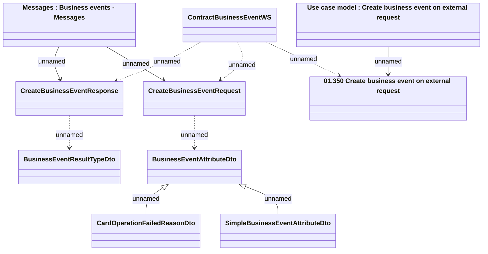

# Business events - provided interface

- **Diagram Type**: Logical
- **Package**: HomerSelect/BSL/Analysis Model/_Interface/Provided Web Services/Business events
- **Diagram ID**: 74002
- **Elements**: 10
- **Connectors**: 10

