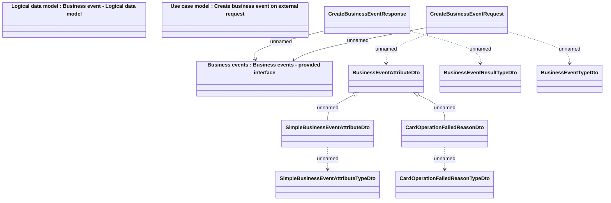

# Business events - Messages

- **Diagram Type**: Logical
- **Package**: HomerSelect/BSL/Analysis Model/_Interface/Provided Web Services/Business events/Messages
- **Diagram ID**: 124047
- **Elements**: 12
- **Connectors**: 9

