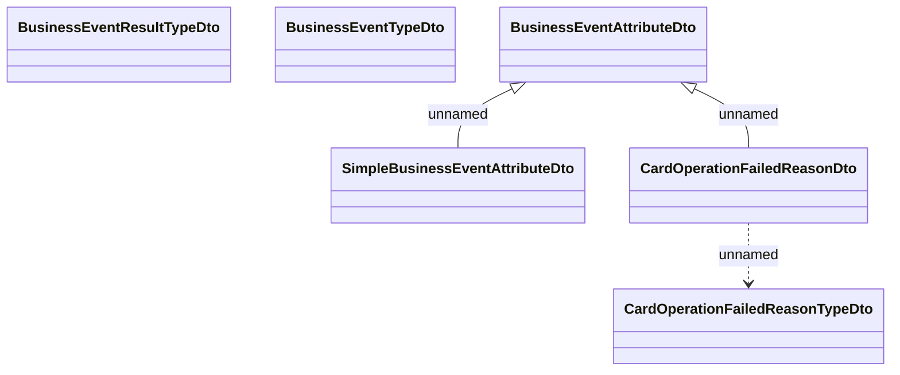

# Business events - Types

- **Diagram Type**: Logical
- **Package**: HomerSelect/BSL/Analysis Model/_Interface/Provided Web Services/Business events/Types
- **Diagram ID**: 130080
- **Elements**: 6
- **Connectors**: 3

