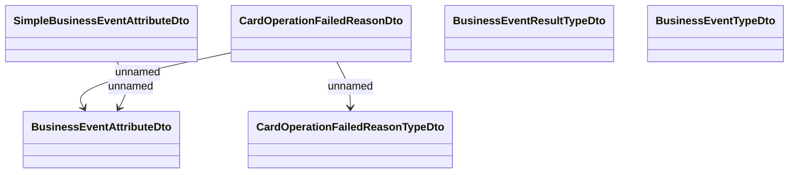

# Business events - Types

```mermaid
classDiagram
    class CardOperationFailedReasonTypeDto["CardOperationFailedReasonTypeDto"]
    class SimpleBusinessEventAttributeDto["SimpleBusinessEventAttributeDto"]
    class CardOperationFailedReasonDto["CardOperationFailedReasonDto"]
    class BusinessEventResultTypeDto["BusinessEventResultTypeDto"]
    class BusinessEventTypeDto["BusinessEventTypeDto"]
    class BusinessEventAttributeDto["BusinessEventAttributeDto"]
    CardOperationFailedReasonDto --> CardOperationFailedReasonTypeDto : unnamed
    CardOperationFailedReasonDto --> BusinessEventAttributeDto : unnamed
    SimpleBusinessEventAttributeDto --> BusinessEventAttributeDto : unnamed
```
