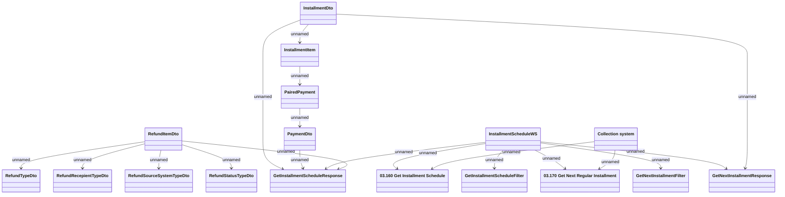

# InstallmentScheduleWS

```mermaid
classDiagram
    class PaymentDto["PaymentDto"]
    class RefundStatusTypeDto["RefundStatusTypeDto"]
    class RefundSourceSystemTypeDto["RefundSourceSystemTypeDto"]
    class RefundRecepientTypeDto["RefundRecepientTypeDto"]
    class RefundTypeDto["RefundTypeDto"]
    class RefundItemDto["RefundItemDto"]
    class Collection_system["Collection system"]
    class GetNextInstallmentResponse["GetNextInstallmentResponse"]
    class GetNextInstallmentFilter["GetNextInstallmentFilter"]
    class GetInstallmentScheduleFilter["GetInstallmentScheduleFilter"]
    class n_03_170_Get_Next_Regular_Installment["03.170 Get Next Regular Installment"]
    class n_03_160_Get_Installment_Schedule["03.160 Get Installment Schedule"]
    class PairedPayment["PairedPayment"]
    class GetInstallmentScheduleResponse["GetInstallmentScheduleResponse"]
    class InstallmentItem["InstallmentItem"]
    class InstallmentDto["InstallmentDto"]
    class InstallmentScheduleWS["InstallmentScheduleWS"]
    RefundItemDto --> RefundStatusTypeDto : unnamed
    RefundItemDto --> RefundSourceSystemTypeDto : unnamed
    RefundItemDto --> RefundRecepientTypeDto : unnamed
    RefundItemDto --> RefundTypeDto : unnamed
    InstallmentScheduleWS --> GetNextInstallmentResponse : unnamed
    InstallmentDto --> GetNextInstallmentResponse : unnamed
    InstallmentScheduleWS --> GetNextInstallmentFilter : unnamed
    PairedPayment --> PaymentDto : unnamed
    InstallmentScheduleWS --> n_03_170_Get_Next_Regular_Installment : unnamed
    InstallmentDto --> InstallmentItem : unnamed
    InstallmentScheduleWS --> n_03_160_Get_Installment_Schedule : unnamed
    InstallmentItem --> PairedPayment : unnamed
    InstallmentDto --> GetInstallmentScheduleResponse : unnamed
    PaymentDto --> GetInstallmentScheduleResponse : unnamed
    InstallmentScheduleWS --> GetInstallmentScheduleResponse : unnamed
    RefundItemDto --> GetInstallmentScheduleResponse : unnamed
    InstallmentScheduleWS --> GetInstallmentScheduleFilter : unnamed
    Collection_system --> n_03_170_Get_Next_Regular_Installment : unnamed
    Collection_system --> n_03_160_Get_Installment_Schedule : unnamed
```
