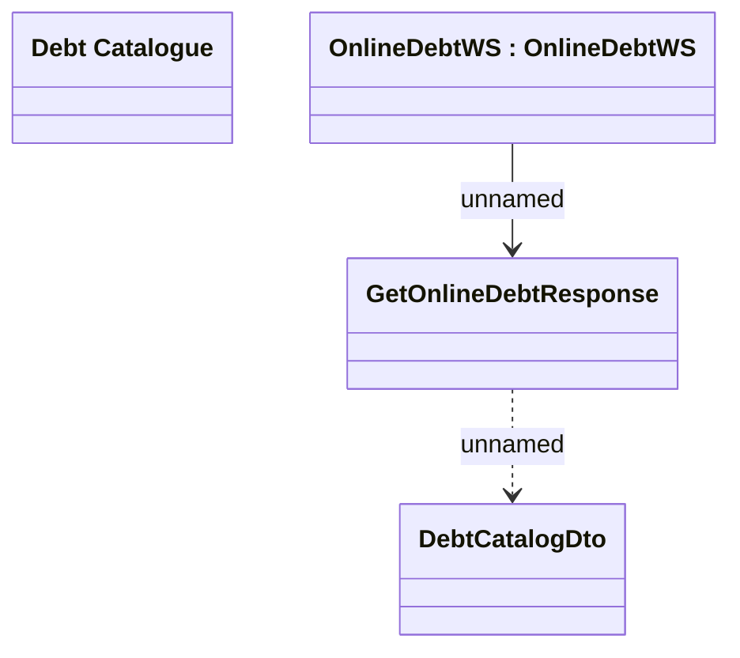

# GetOnlineDebtResponse - Mapping to DebtCatalog

- **Diagram Type**: Logical
- **Package**: HomerSelect/BSL/Analysis Model/_Interface/Provided Web Services/Collection/OnlineDebtWS
- **Diagram ID**: 134852
- **Elements**: 4
- **Connectors**: 2

