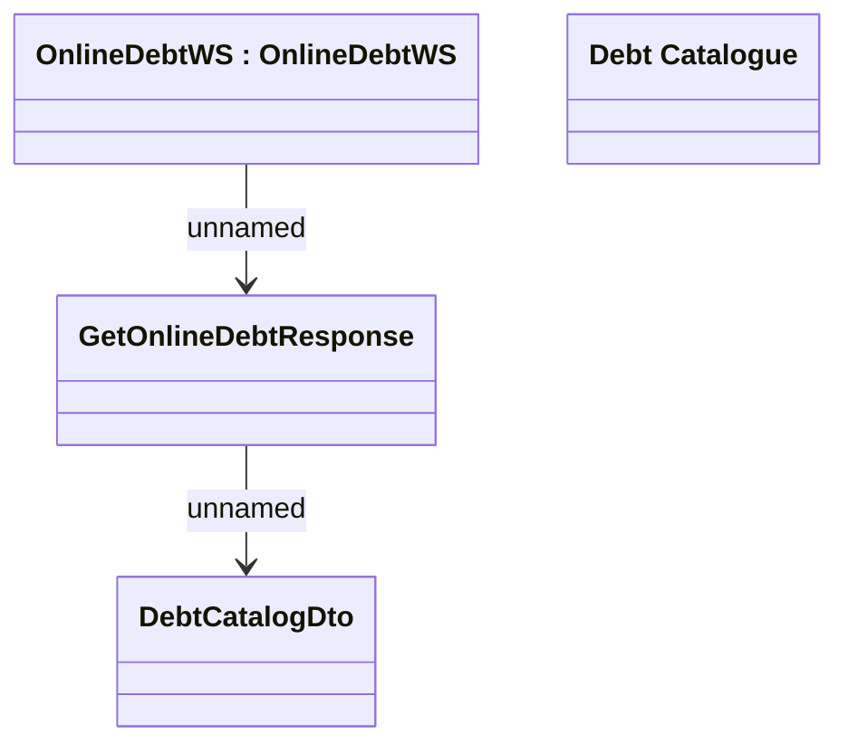

# GetOnlineDebtResponse - Mapping to DebtCatalog

```mermaid
classDiagram
    class OnlineDebtWS_OnlineDebtWS["OnlineDebtWS : OnlineDebtWS"]
    class GetOnlineDebtResponse["GetOnlineDebtResponse"]
    class DebtCatalogDto["DebtCatalogDto"]
    class Debt_Catalogue["Debt Catalogue"]
    OnlineDebtWS_OnlineDebtWS --> GetOnlineDebtResponse : unnamed
    GetOnlineDebtResponse --> DebtCatalogDto : unnamed
```
