# OnlineDebtWS

- **Diagram Type**: Logical
- **Package**: HomerSelect/BSL/Analysis Model/_Interface/Provided Web Services/Collection/OnlineDebtWS
- **Diagram ID**: 134851
- **Elements**: 15
- **Connectors**: 11

```mermaid
classDiagram
    class n_01_481_Get_debt_statistics["01.481 Get debt statistics"]
    class n_01_483_Calculate_debt_on_external_request["01.483 Calculate debt on external request"]
    class n_01_471_Get_debt_catalogue_for_external_system["01.471 Get debt catalogue for external system"]
    class UseCase_Model_Calculate_debt_on_external_request["UseCase Model : Calculate debt on external request"]
    class External_system["External system"]
    class FeeDebt["FeeDebt"]
    class CalculateDebtResponse["CalculateDebtResponse"]
    class CalculateDebtRequest["CalculateDebtRequest"]
    class CaBus_AM["CaBus-AM"]
    class GetDebtStatResponse["GetDebtStatResponse"]
    class GetDebtStatRequest["GetDebtStatRequest"]
    class Collection_system["Collection system"]
    class GetOnlineDebtResponse["GetOnlineDebtResponse"]
    class GetOnlineDebtRequest["GetOnlineDebtRequest"]
    class OnlineDebtWS["OnlineDebtWS"]
    OnlineDebtWS ..> GetOnlineDebtRequest : unnamed
    OnlineDebtWS ..> GetOnlineDebtResponse : unnamed
    OnlineDebtWS --> GetDebtStatRequest : unnamed
    OnlineDebtWS --> GetDebtStatResponse : unnamed
    OnlineDebtWS ..> CalculateDebtRequest : unnamed
    OnlineDebtWS ..> CalculateDebtResponse : unnamed
    CalculateDebtResponse ..> FeeDebt : unnamed
    Collection_system --> n_01_471_Get_debt_catalogue_for_external_system : unnamed
    External_system --> n_01_483_Calculate_debt_on_external_request : unnamed
    CaBus_AM --> n_01_481_Get_debt_statistics : unnamed
    External_system --> n_01_471_Get_debt_catalogue_for_external_system : unnamed
```

