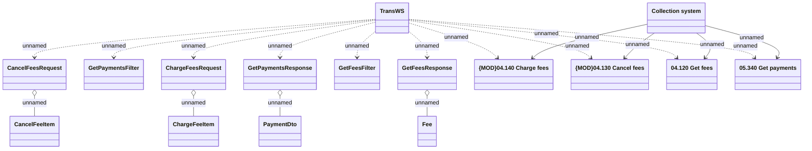

# TransWS

- **Diagram Type**: Logical
- **Package**: HomerSelect/BSL/Analysis Model/_Interface/Provided Web Services/Collection/TransWS
- **Diagram ID**: 162663
- **Elements**: 16
- **Connectors**: 18

