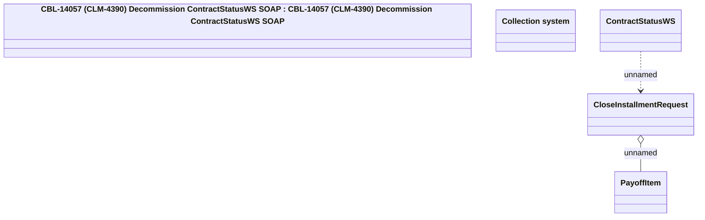

# ContractStatusWS

- **Diagram Type**: Logical
- **Package**: HomerSelect/BSL/Analysis Model/_Interface/Provided Web Services/Collection/{DEL CLM-4390 /}ContractStatusWS
- **Diagram ID**: 139251
- **Elements**: 5
- **Connectors**: 2

