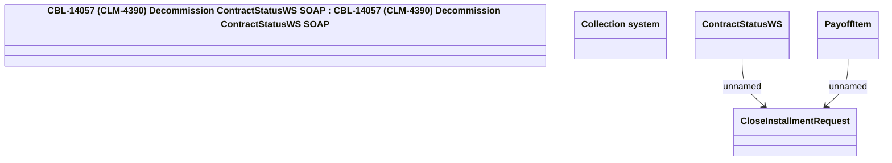

# ContractStatusWS

```mermaid
classDiagram
    class CBL_14057_CLM_4390_Decommission_ContractStatusWS_SOAP_CBL_14["CBL-14057 (CLM-4390) Decommission ContractStatusWS SOAP : CBL-14057 (CLM-4390) Decommission ContractStatusWS SOAP"]
    class Collection_system["Collection system"]
    class CloseInstallmentRequest["CloseInstallmentRequest"]
    class PayoffItem["PayoffItem"]
    class ContractStatusWS["ContractStatusWS"]
    ContractStatusWS --> CloseInstallmentRequest : unnamed
    PayoffItem --> CloseInstallmentRequest : unnamed
```
