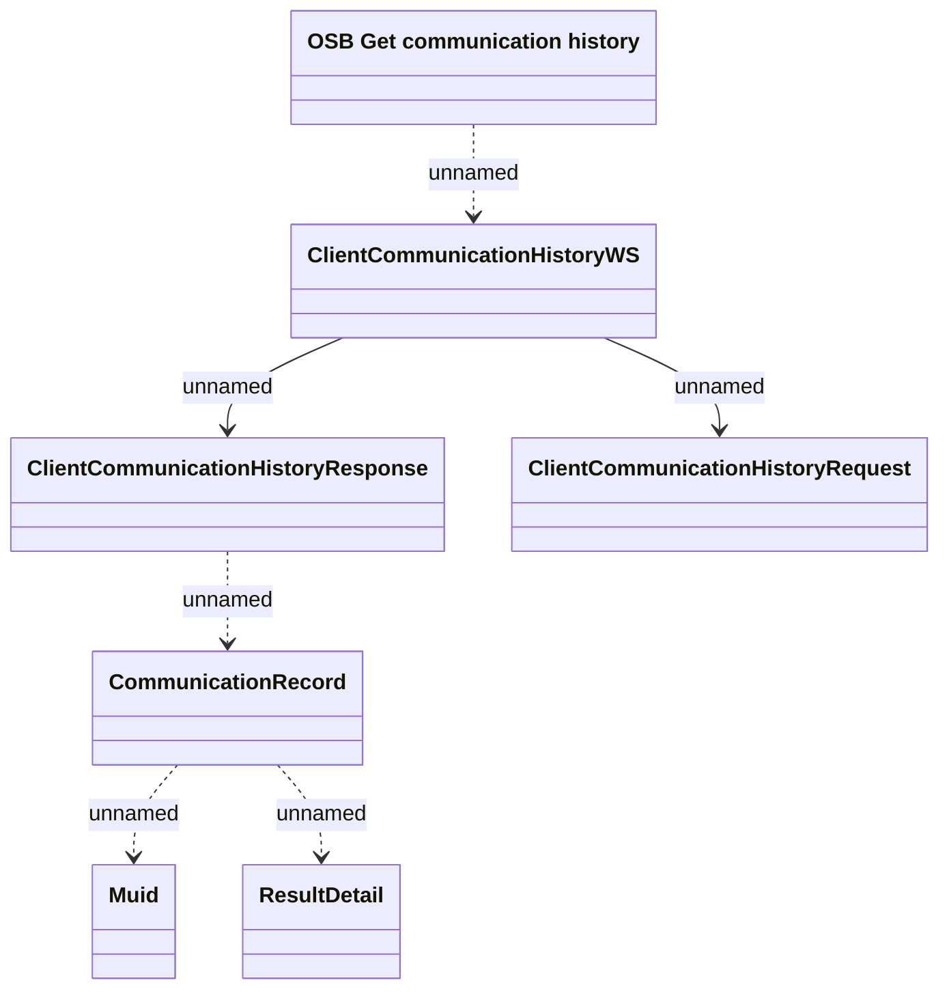

# List of communication

- **Diagram Type**: Logical
- **Package**: HomerSelect/BSL/Analysis Model/_Interface/Provided Web Services/Communication/ClientCommunicationHistoryWS
- **Diagram ID**: 146245
- **Elements**: 7
- **Connectors**: 6

