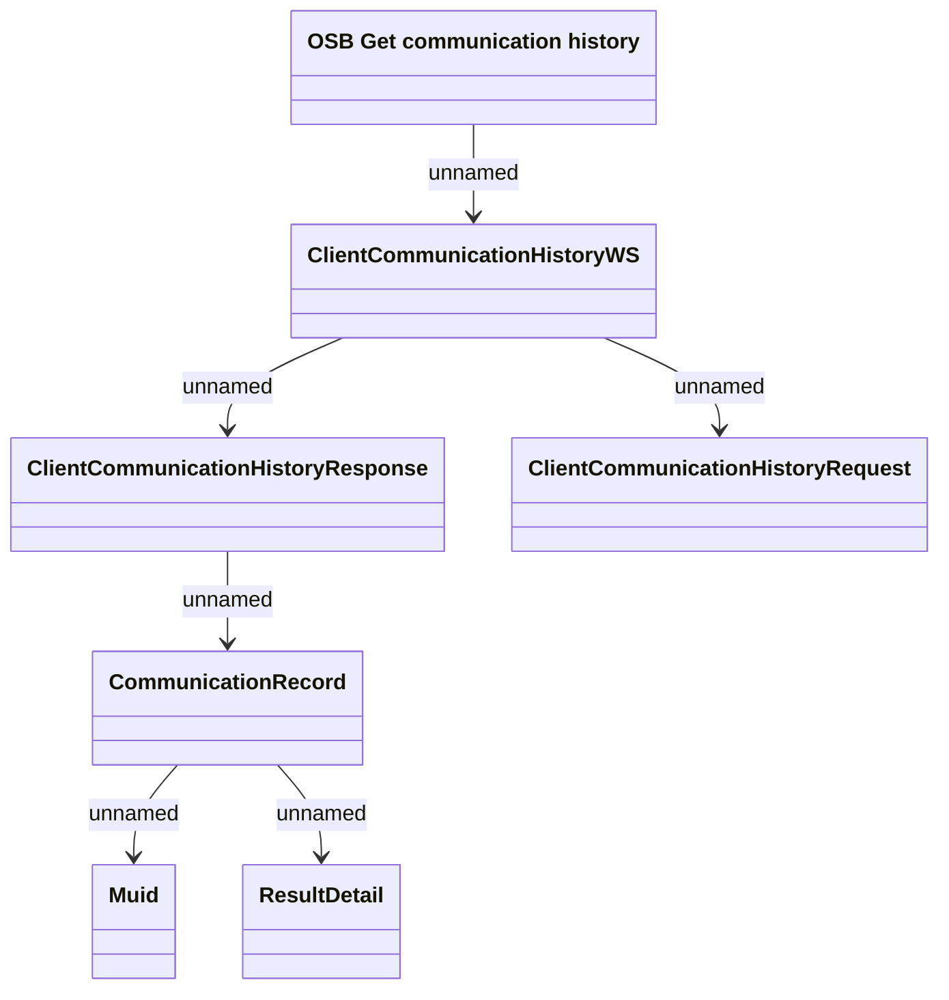

# List of communication

```mermaid
classDiagram
    class Muid["Muid"]
    class ResultDetail["ResultDetail"]
    class CommunicationRecord["CommunicationRecord"]
    class ClientCommunicationHistoryResponse["ClientCommunicationHistoryResponse"]
    class ClientCommunicationHistoryRequest["ClientCommunicationHistoryRequest"]
    class OSB_Get_communication_history["OSB Get communication history"]
    class ClientCommunicationHistoryWS["ClientCommunicationHistoryWS"]
    ClientCommunicationHistoryWS --> ClientCommunicationHistoryRequest : unnamed
    ClientCommunicationHistoryWS --> ClientCommunicationHistoryResponse : unnamed
    OSB_Get_communication_history --> ClientCommunicationHistoryWS : unnamed
    ClientCommunicationHistoryResponse --> CommunicationRecord : unnamed
    CommunicationRecord --> Muid : unnamed
    CommunicationRecord --> ResultDetail : unnamed
```
