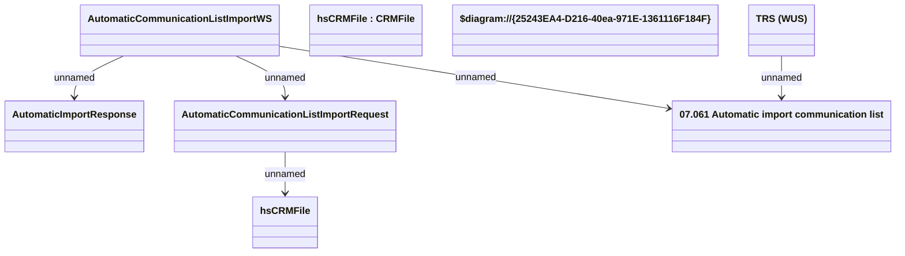

# AutomaticCommunicationListImportWS

```mermaid
classDiagram
    class AutomaticImportResponse["AutomaticImportResponse"]
    class AutomaticCommunicationListImportRequest["AutomaticCommunicationListImportRequest"]
    class TRS_WUS["TRS (WUS)"]
    class hsCRMFile_CRMFile["hsCRMFile : CRMFile"]
    class hsCRMFile["hsCRMFile"]
    class diagram_25243EA4_D216_40ea_971E_1361116F184F["$diagram://{25243EA4-D216-40ea-971E-1361116F184F}"]
    class AutomaticCommunicationListImportWS["AutomaticCommunicationListImportWS"]
    class n_07_061_Automatic_import_communication_list["07.061 Automatic import communication list"]
    AutomaticCommunicationListImportWS --> n_07_061_Automatic_import_communication_list : unnamed
    AutomaticCommunicationListImportRequest --> hsCRMFile : unnamed
    AutomaticCommunicationListImportWS --> AutomaticCommunicationListImportRequest : unnamed
    AutomaticCommunicationListImportWS --> AutomaticImportResponse : unnamed
    TRS_WUS --> n_07_061_Automatic_import_communication_list : unnamed
```
