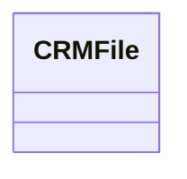

# CommunicationFileStructure

- **Diagram Type**: Logical
- **Package**: HomerSelect/BSL/Analysis Model/_Interface/Provided Web Services/Communication/CommunicationListImportWS/CommunicationFileStructure
- **Diagram ID**: 100237
- **Elements**: 1
- **Connectors**: 0

