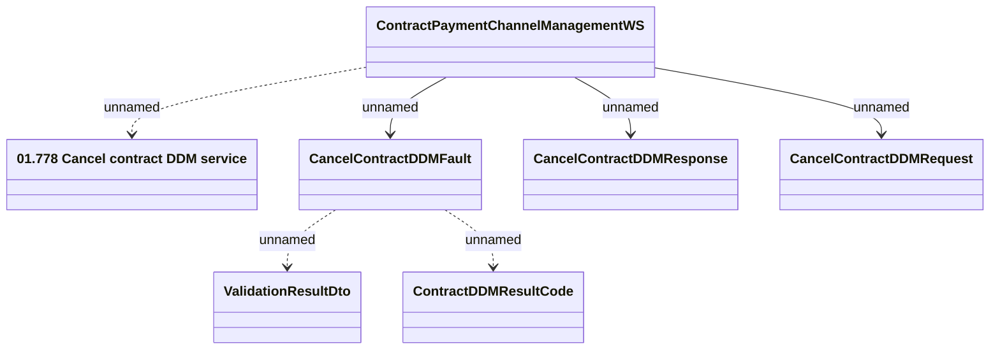

# ContractPaymentChannelManagementWS - CancelContractDDM

- **Diagram Type**: Logical
- **Package**: HomerSelect/BSL/Analysis Model/_Interface/Provided Web Services/Contract/Contract Payment Channel Management
- **Diagram ID**: 107843
- **Elements**: 7
- **Connectors**: 6

