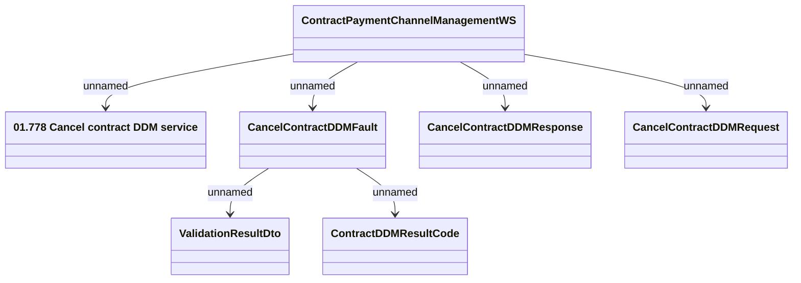

# ContractPaymentChannelManagementWS - CancelContractDDM

```mermaid
classDiagram
    class ValidationResultDto["ValidationResultDto"]
    class n_01_778_Cancel_contract_DDM_service["01.778 Cancel contract DDM service"]
    class ContractDDMResultCode["ContractDDMResultCode"]
    class CancelContractDDMFault["CancelContractDDMFault"]
    class CancelContractDDMResponse["CancelContractDDMResponse"]
    class CancelContractDDMRequest["CancelContractDDMRequest"]
    class ContractPaymentChannelManagementWS["ContractPaymentChannelManagementWS"]
    ContractPaymentChannelManagementWS --> CancelContractDDMResponse : unnamed
    ContractPaymentChannelManagementWS --> n_01_778_Cancel_contract_DDM_service : unnamed
    ContractPaymentChannelManagementWS --> CancelContractDDMFault : unnamed
    ContractPaymentChannelManagementWS --> CancelContractDDMRequest : unnamed
    CancelContractDDMFault --> ValidationResultDto : unnamed
    CancelContractDDMFault --> ContractDDMResultCode : unnamed
```
