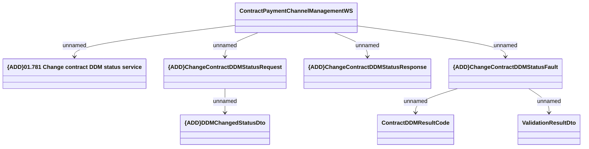

# ContractPaymentChannelManagementWS - ChangeContractDDMStatus

```mermaid
classDiagram
    class ADD_01_781_Change_contract_DDM_status_service["{ADD}01.781 Change contract DDM status service"]
    class ContractDDMResultCode["ContractDDMResultCode"]
    class ValidationResultDto["ValidationResultDto"]
    class ADD_ChangeContractDDMStatusFault["{ADD}ChangeContractDDMStatusFault"]
    class ADD_DDMChangedStatusDto["{ADD}DDMChangedStatusDto"]
    class ADD_ChangeContractDDMStatusResponse["{ADD}ChangeContractDDMStatusResponse"]
    class ADD_ChangeContractDDMStatusRequest["{ADD}ChangeContractDDMStatusRequest"]
    class ContractPaymentChannelManagementWS["ContractPaymentChannelManagementWS"]
    ContractPaymentChannelManagementWS --> ADD_ChangeContractDDMStatusRequest : unnamed
    ContractPaymentChannelManagementWS --> ADD_ChangeContractDDMStatusResponse : unnamed
    ContractPaymentChannelManagementWS --> ADD_ChangeContractDDMStatusFault : unnamed
    ContractPaymentChannelManagementWS --> ADD_01_781_Change_contract_DDM_status_service : unnamed
    ADD_ChangeContractDDMStatusRequest --> ADD_DDMChangedStatusDto : unnamed
    ADD_ChangeContractDDMStatusFault --> ContractDDMResultCode : unnamed
    ADD_ChangeContractDDMStatusFault --> ValidationResultDto : unnamed
```
