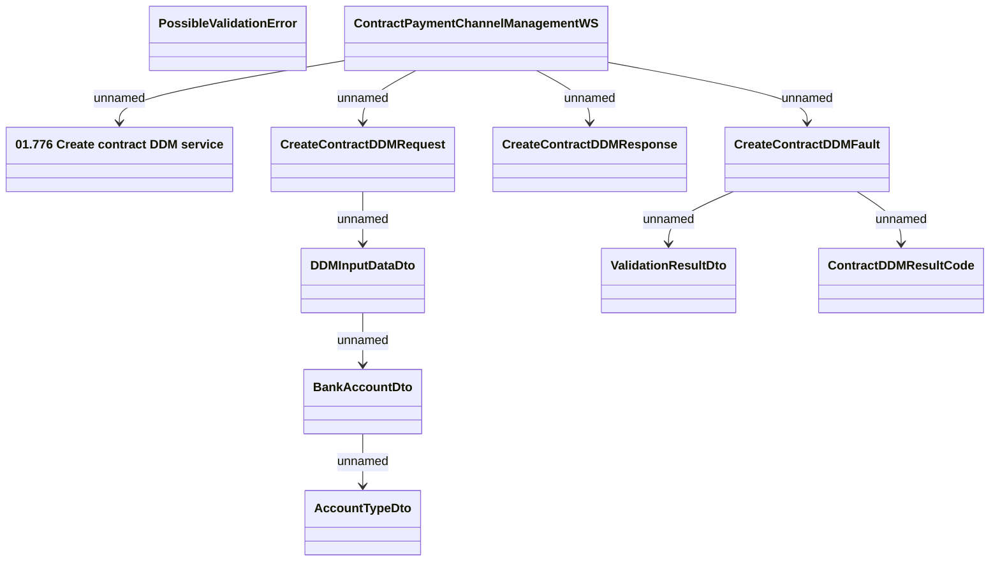

# ContractPaymentChannelManagementWS - CreateContractDDM API

```mermaid
classDiagram
    class PossibleValidationError["PossibleValidationError"]
    class DDMInputDataDto["DDMInputDataDto"]
    class ValidationResultDto["ValidationResultDto"]
    class n_01_776_Create_contract_DDM_service["01.776 Create contract DDM service"]
    class AccountTypeDto["AccountTypeDto"]
    class BankAccountDto["BankAccountDto"]
    class ContractDDMResultCode["ContractDDMResultCode"]
    class CreateContractDDMFault["CreateContractDDMFault"]
    class CreateContractDDMResponse["CreateContractDDMResponse"]
    class CreateContractDDMRequest["CreateContractDDMRequest"]
    class ContractPaymentChannelManagementWS["ContractPaymentChannelManagementWS"]
    ContractPaymentChannelManagementWS --> n_01_776_Create_contract_DDM_service : unnamed
    ContractPaymentChannelManagementWS --> CreateContractDDMResponse : unnamed
    ContractPaymentChannelManagementWS --> CreateContractDDMRequest : unnamed
    ContractPaymentChannelManagementWS --> CreateContractDDMFault : unnamed
    CreateContractDDMRequest --> DDMInputDataDto : unnamed
    CreateContractDDMFault --> ContractDDMResultCode : unnamed
    CreateContractDDMFault --> ValidationResultDto : unnamed
    BankAccountDto --> AccountTypeDto : unnamed
    DDMInputDataDto --> BankAccountDto : unnamed
```
