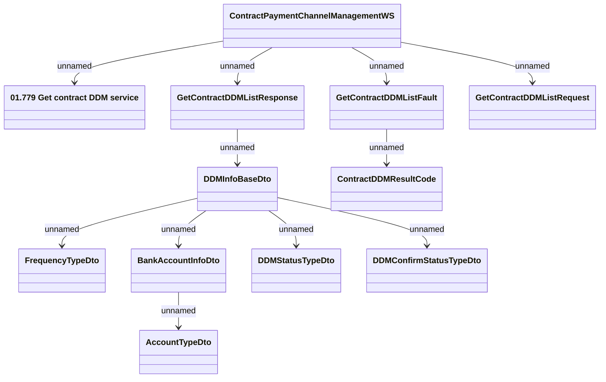

# ContractPaymentChannelManagementWS - GetContractDDMList

```mermaid
classDiagram
    class FrequencyTypeDto["FrequencyTypeDto"]
    class AccountTypeDto["AccountTypeDto"]
    class BankAccountInfoDto["BankAccountInfoDto"]
    class DDMStatusTypeDto["DDMStatusTypeDto"]
    class DDMConfirmStatusTypeDto["DDMConfirmStatusTypeDto"]
    class DDMInfoBaseDto["DDMInfoBaseDto"]
    class n_01_779_Get_contract_DDM_service["01.779 Get contract DDM service"]
    class ContractDDMResultCode["ContractDDMResultCode"]
    class GetContractDDMListFault["GetContractDDMListFault"]
    class GetContractDDMListResponse["GetContractDDMListResponse"]
    class GetContractDDMListRequest["GetContractDDMListRequest"]
    class ContractPaymentChannelManagementWS["ContractPaymentChannelManagementWS"]
    ContractPaymentChannelManagementWS --> GetContractDDMListResponse : unnamed
    ContractPaymentChannelManagementWS --> n_01_779_Get_contract_DDM_service : unnamed
    ContractPaymentChannelManagementWS --> GetContractDDMListRequest : unnamed
    ContractPaymentChannelManagementWS --> GetContractDDMListFault : unnamed
    GetContractDDMListResponse --> DDMInfoBaseDto : unnamed
    GetContractDDMListFault --> ContractDDMResultCode : unnamed
    DDMInfoBaseDto --> BankAccountInfoDto : unnamed
    BankAccountInfoDto --> AccountTypeDto : unnamed
    DDMInfoBaseDto --> FrequencyTypeDto : unnamed
    DDMInfoBaseDto --> DDMConfirmStatusTypeDto : unnamed
    DDMInfoBaseDto --> DDMStatusTypeDto : unnamed
```
