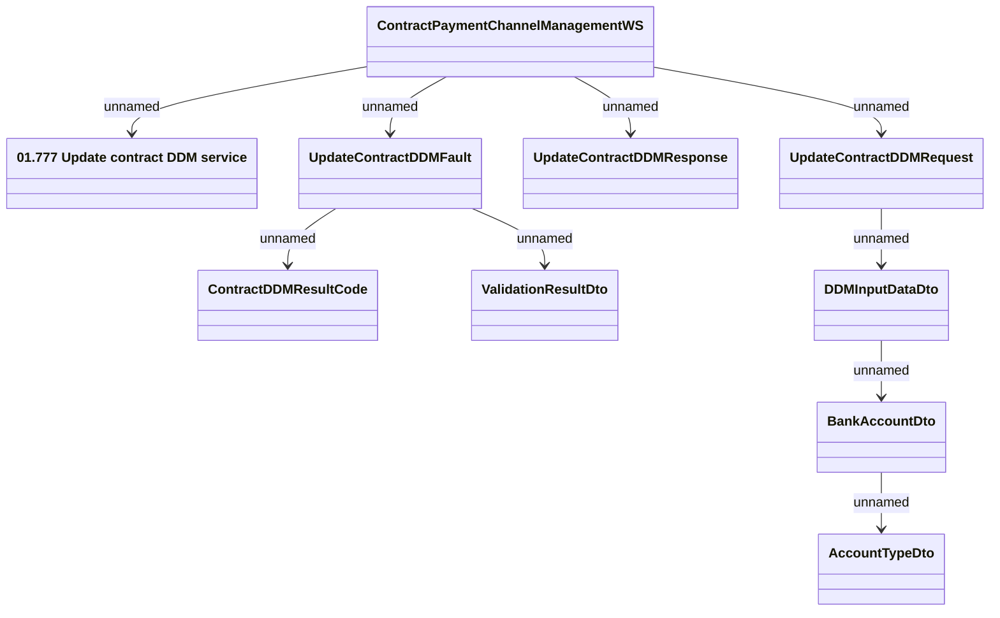

# ContractPaymentChannelManagementWS - UpdateContractDDM

```mermaid
classDiagram
    class ContractDDMResultCode["ContractDDMResultCode"]
    class ValidationResultDto["ValidationResultDto"]
    class n_01_777_Update_contract_DDM_service["01.777 Update contract DDM service"]
    class DDMInputDataDto["DDMInputDataDto"]
    class AccountTypeDto["AccountTypeDto"]
    class BankAccountDto["BankAccountDto"]
    class UpdateContractDDMFault["UpdateContractDDMFault"]
    class UpdateContractDDMResponse["UpdateContractDDMResponse"]
    class UpdateContractDDMRequest["UpdateContractDDMRequest"]
    class ContractPaymentChannelManagementWS["ContractPaymentChannelManagementWS"]
    ContractPaymentChannelManagementWS --> UpdateContractDDMFault : unnamed
    ContractPaymentChannelManagementWS --> UpdateContractDDMRequest : unnamed
    ContractPaymentChannelManagementWS --> UpdateContractDDMResponse : unnamed
    ContractPaymentChannelManagementWS --> n_01_777_Update_contract_DDM_service : unnamed
    UpdateContractDDMRequest --> DDMInputDataDto : unnamed
    UpdateContractDDMFault --> ContractDDMResultCode : unnamed
    UpdateContractDDMFault --> ValidationResultDto : unnamed
    BankAccountDto --> AccountTypeDto : unnamed
    DDMInputDataDto --> BankAccountDto : unnamed
```
