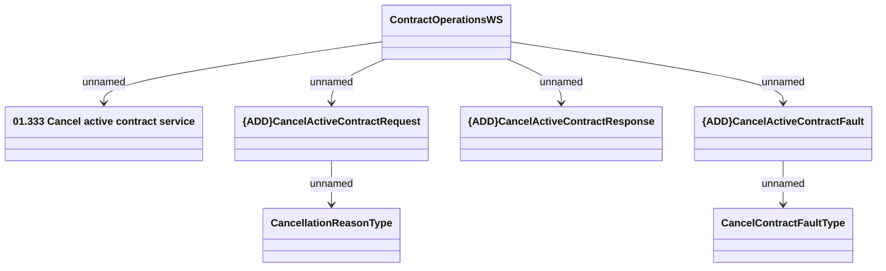

# ContractOperationWS - Cancel active contract

```mermaid
classDiagram
    class n_01_333_Cancel_active_contract_service["01.333 Cancel active contract service"]
    class ADD_CancelActiveContractFault["{ADD}CancelActiveContractFault"]
    class ADD_CancelActiveContractResponse["{ADD}CancelActiveContractResponse"]
    class ADD_CancelActiveContractRequest["{ADD}CancelActiveContractRequest"]
    class CancellationReasonType["CancellationReasonType"]
    class CancelContractFaultType["CancelContractFaultType"]
    class ContractOperationsWS["ContractOperationsWS"]
    ADD_CancelActiveContractFault --> CancelContractFaultType : unnamed
    ADD_CancelActiveContractRequest --> CancellationReasonType : unnamed
    ContractOperationsWS --> ADD_CancelActiveContractRequest : unnamed
    ContractOperationsWS --> ADD_CancelActiveContractResponse : unnamed
    ContractOperationsWS --> ADD_CancelActiveContractFault : unnamed
    ContractOperationsWS --> n_01_333_Cancel_active_contract_service : unnamed
```
