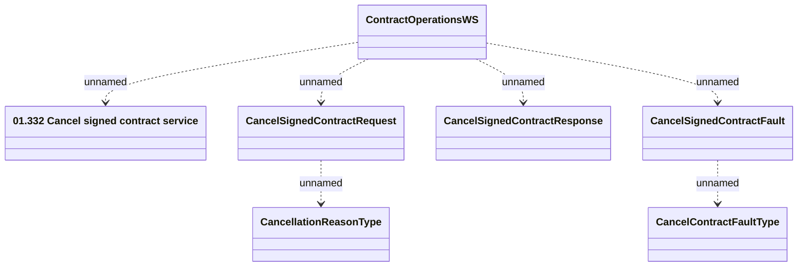

# ContractOperationWS - Cancel signed contract

- **Diagram Type**: Logical
- **Package**: HomerSelect/BSL/Analysis Model/_Interface/Provided Web Services/Contract/ContractOperationWS
- **Diagram ID**: 146651
- **Elements**: 7
- **Connectors**: 6

