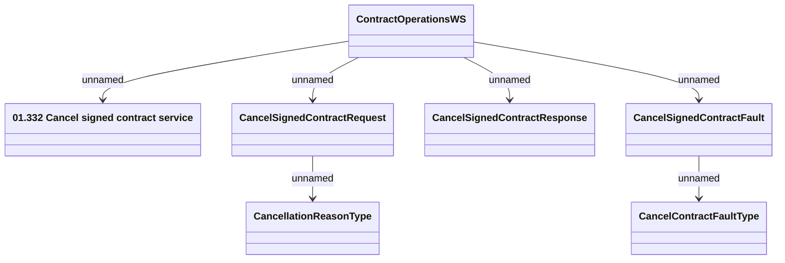

# ContractOperationWS - Cancel signed contract

```mermaid
classDiagram
    class CancellationReasonType["CancellationReasonType"]
    class CancelContractFaultType["CancelContractFaultType"]
    class n_01_332_Cancel_signed_contract_service["01.332 Cancel signed contract service"]
    class CancelSignedContractFault["CancelSignedContractFault"]
    class CancelSignedContractResponse["CancelSignedContractResponse"]
    class CancelSignedContractRequest["CancelSignedContractRequest"]
    class ContractOperationsWS["ContractOperationsWS"]
    ContractOperationsWS --> CancelSignedContractRequest : unnamed
    ContractOperationsWS --> CancelSignedContractResponse : unnamed
    ContractOperationsWS --> CancelSignedContractFault : unnamed
    ContractOperationsWS --> n_01_332_Cancel_signed_contract_service : unnamed
    CancelSignedContractFault --> CancelContractFaultType : unnamed
    CancelSignedContractRequest --> CancellationReasonType : unnamed
```
