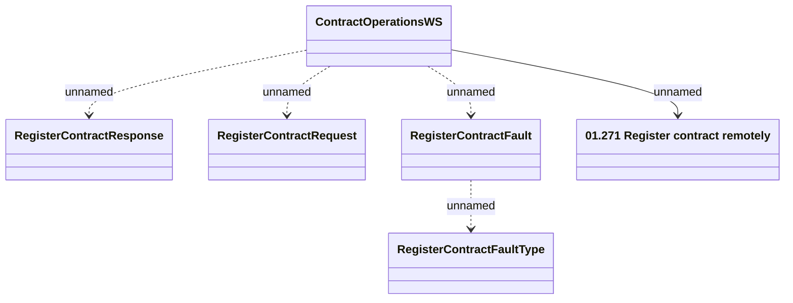

# ContractOperationWS - RegisterContract

- **Diagram Type**: Logical
- **Package**: HomerSelect/BSL/Analysis Model/_Interface/Provided Web Services/Contract/ContractOperationWS
- **Diagram ID**: 146652
- **Elements**: 6
- **Connectors**: 5

