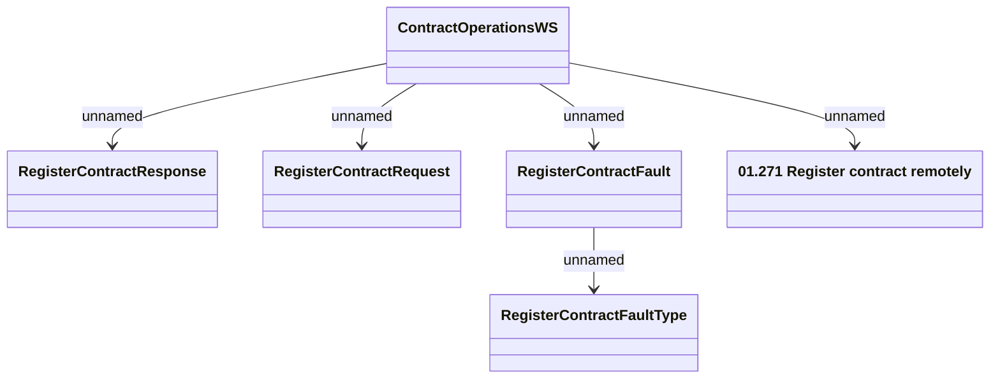

# ContractOperationWS - RegisterContract

```mermaid
classDiagram
    class RegisterContractFaultType["RegisterContractFaultType"]
    class RegisterContractResponse["RegisterContractResponse"]
    class RegisterContractRequest["RegisterContractRequest"]
    class RegisterContractFault["RegisterContractFault"]
    class ContractOperationsWS["ContractOperationsWS"]
    class n_01_271_Register_contract_remotely["01.271 Register contract remotely"]
    ContractOperationsWS --> n_01_271_Register_contract_remotely : unnamed
    ContractOperationsWS --> RegisterContractFault : unnamed
    ContractOperationsWS --> RegisterContractRequest : unnamed
    ContractOperationsWS --> RegisterContractResponse : unnamed
    RegisterContractFault --> RegisterContractFaultType : unnamed
```
